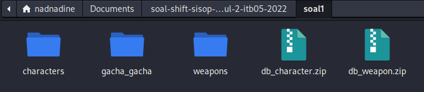

# soal-shift-sisop-modul-2-ITB05-2022

Pengerjaan Soal Shift Modul 2 oleh ITB05

# Anggota

| Nama                           | NRP          | 
| -------------------------------| -------------| 
| Nadine Haninta                 | `5027201014` | 
| Danish Putra Dandi             | `5027201048` | 
| Mutiara Nuraisyah Dinda R.     | `5027201054` |

# Konten
* [Sumber Soal Praktikum Sistem Operasi Modul 2 Tahun 2022](#sumber-soal-praktikum-sistem-operasi-modul-2-tahun-2022)
* [Soal 1](#soal-1)
    * [Soal 1.a](#soal-1a)
    * [Soal 1.b](#soal-1b)
    * [Soal 1.c](#soal-1c)
    * [Soal 1.d](#soal-1d)
    * [Soal 1.e](#soal-1e)
	* [Kendala](#kendala)
    * [Dokumentasi](#dokumentasi)
* [Soal 2](#soal-2)
    * [Soal 2.a](#soal-2a)
    * [Soal 2.b](#soal-2b)
    * [Soal 2.c](#soal-2c)
    * [Soal 2.d](#soal-2d)
    * [Soal 2.e](#soal-2e)
    * [Kendala](#kendala)
    * [Dokumentasi](#dokumentasi)
* [Soal 3](#soal-3)
    * [Soal 3.a](#soal-3a)
    * [Soal 3.b](#soal-3b)
    * [Soal 3.c](#soal-3c)
    * [Soal 3.d](#soal-3d)
    * [Soal 3.e](#soal-3e)
    * [Kendala](#kendala)
    * [Dokumentasi](#dokumentasi)


## Sumber Soal Praktikum Sistem Operasi Modul 2 Tahun 2022

[Sumber Soal](https://docs.google.com/document/d/1qWo-VT3bYx8t9Bnpbq_h8Mpn9FpBM3t4T6SWX3vn9RI/edit)
Dibuka menggunakan E-mail ITS


## Soal 1
Mas Refadi adalah seorang wibu gemink.  Dan jelas game favoritnya adalah bengshin impek. Terlebih pada game tersebut ada sistem gacha item yang membuat orang-orang selalu ketagihan untuk terus melakukan nya. Tidak terkecuali dengan mas Refadi sendiri. Karena rasa penasaran bagaimana sistem gacha bekerja, maka dia ingin membuat sebuah program untuk men-simulasi sistem history gacha item pada game tersebut. Tetapi karena dia lebih suka nge-wibu dibanding ngoding, maka dia meminta bantuanmu untuk membuatkan program nya. Sebagai seorang programmer handal, bantulah mas Refadi untuk memenuhi keinginan nya itu. <br>
a. Saat program pertama kali berjalan. Program akan mendownload file characters dan file weapons dari link yang ada dibawah, lalu program akan mengekstrak kedua file tersebut. File tersebut akan digunakan sebagai database untuk melakukan gacha item characters dan weapons. Kemudian akan dibuat sebuah folder dengan nama “gacha_gacha” sebagai working directory. Seluruh hasil gacha akan berada di dalam folder tersebut. Penjelasan sistem gacha ada di poin (d).<br>
b. Mas Refadi ingin agar setiap kali gacha, item characters dan item weapon akan selalu bergantian diambil datanya dari database. Maka untuk setiap kali jumlah-gacha nya bernilai genap akan dilakukan gacha item weapons, jika bernilai ganjil maka item characters. Lalu untuk setiap kali jumlah-gacha nya mod 10, maka akan dibuat sebuah file baru (.txt) dan output hasil gacha selanjutnya akan berada di dalam file baru tersebut. Dan setiap kali jumlah-gacha nya mod 90, maka akan dibuat sebuah folder baru dan file (.txt) selanjutnya akan berada didalam folder baru tersebut.  Sehingga untuk setiap folder, akan terdapat 9 file (.txt) yang didalamnya berisi 10 hasil gacha. Dan karena ini simulasi gacha, maka hasil gacha di dalam file .txt adalah ACAK/RANDOM dan setiap file (.txt) isi nya akan BERBEDA <br>
c. Format penamaan setiap file (.txt) nya adalah {Hh:Mm:Ss}_gacha_{jumlah-gacha}, misal 04:44:12_gacha_120.txt, dan format penamaan untuk setiap folder nya adalah total_gacha_{jumlah-gacha}, misal total_gacha_270. Dan untuk setiap file (.txt) akan memiliki perbedaan penamaan waktu output sebesar 1 second. <br>
d.Pada game tersebut, untuk melakukan gacha item kita harus menggunakan alat tukar yang dinamakan primogems. Satu kali gacha item akan menghabiskan primogems sebanyak 160 primogems. Karena mas Refadi ingin agar hasil simulasi gacha nya terlihat banyak, maka pada program, primogems di awal di-define sebanyak 79000 primogems. Setiap kali gacha, ada 2 properties yang akan diambil dari database, yaitu name dan rarity. Lalu Outpukan hasil gacha nya ke dalam file (.txt) dengan format hasil gacha {jumlah-gacha}_[tipe-item]_{rarity}_{name}_{sisa-primogems}. Program akan selalu melakukan gacha hingga primogems habis.<br>
Contoh : 157_characters_5_Albedo_53880<br>
e. Proses untuk melakukan gacha item akan dimulai bertepatan dengan anniversary pertama kali mas Refadi bermain bengshin impek, yaitu pada 30 Maret jam 04:44.  Kemudian agar hasil gacha nya tidak dilihat oleh teman kos nya, maka 3 jam setelah anniversary tersebut semua isi di folder gacha_gacha akan di zip dengan nama not_safe_for_wibu dengan dipassword "satuduatiga", lalu semua folder akan di delete sehingga hanya menyisakan file (.zip) <br>

### Soal 1.a
Pada soal ini diarahkan untuk membuat suatu folder bernama `gacha_gacha`. Maka, digunakan suatu fungsi `void st_directory()` untuk melakukan fungsi tersebut
```c
void st_directory(){
    pid_t child_1 = fork();
    if (child_1 < 0) {
        printf ("Gagal membuat folder gacha_gacha :(");
		exit(EXIT_FAILURE);
        // Jika gagal membuat proses baru, program akan berhenti
	}
    if (child_1 == 0) {
	// this is child
		char *argv[] = {"mkdir", "-p", "gacha_gacha"};
		execv("/bin/mkdir", argv);
    }
}
```
Adapun proses yang digunakan adalah membuat suatu directory melalui perintah `execv` dan menambahkan nama dari folder tersebut. <br> <br>
Adapula arahan untuk membuat proses download yang dilanjutkan untuk meng-unzip folder
```c
void dl_database() {
    pid_t child_1, child_2;
    child_1 = fork();
    child_2 = fork();
    int status;

    if (child_1 == 0 && child_2 > 0 ) {
	// this is child
		char *argv[] = {"wget", "-q", "--no-check-certificate", "https://drive.google.com/u/0/uc?id=1xYYmsslb-9s8-4BDvosym7R4EmPi6BHp&export=download", "-O", "db_character.zip"};
		execv("/bin/wget", argv);
    } 
    else if (child_1 > 0 && child_2 == 0) {
		char *argv[] = {"wget","-q", "--no-check-certificate", "https://drive.google.com/u/0/uc?id=1XSkAqqjkNmzZ0AdIZQt_eWGOZ0eJyNlT&export=download", "-O", "db_weapon.zip"};
		execv("/bin/wget", argv);
    } 

    else if (child_1 < 0 && child_2 < 0 ) {
        printf ("Gagal mengunduh database :(");
		exit(EXIT_FAILURE);
        // Jika gagal membuat proses baru, program akan berhenti
	}
    else if (child_1 > 0 && child_2 > 0 ) {
        while ((wait(&status)) > 0);
        char *argv1[] = {"unzip","*.zip"};
	    execv("/bin/unzip", argv1);   
    }

}
```
Adapun proses yang digunakan adalah mengunduh melalui perintah `execv` dan menambahkan tautan serta nama akhir dari file yang terunduh. Setelah kedua unduhan brhasil, akan dilanjutkan dengan proses unzip dari file yang terunduh


## Kendala
1) Kesulitan melakukan parsing JSON <br>
2) Kesulitan melakukan sistem gacha dan menuliskan hasilnya dalam sebuah file txt dengan nama tertentu<br>
3) Kesulitan mengimplementasikan penghapusan data setelah waktu tertentu <br>
Meliputi poin 2.b, 2.c, 2.d, dan 2.e

## Dokumentasi
- Hasil Output (Unduhan dan folder)


# Soal 2

2.	Japrun bekerja di sebuah perusahaan dibidang review industri perfilman, karena kondisi saat ini sedang pandemi Covid-19, dia mendapatkan sebuah proyek untuk mencari drama korea yang tayang dan sedang ramai di Layanan Streaming Film untuk diberi review. Japrun sudah mendapatkan beberapa foto-foto poster serial dalam bentuk zip untuk diberikan review, tetapi didalam zip tersebut banyak sekali poster drama korea dan dia harus memisahkan poster-poster drama korea tersebut tergantung dengan kategorinya. Japrun merasa kesulitan untuk melakukan pekerjaannya secara manual, kamu sebagai programmer diminta Japrun untuk menyelesaikan pekerjaannya. <br><br>
a.	Hal pertama yang perlu dilakukan oleh program adalah mengextract zip yang diberikan ke dalam folder “/home/[user]/shift2/drakor”. Karena atasan Japrun teledor, dalam zip tersebut bisa berisi folder-folder yang tidak penting, maka program harus bisa membedakan file dan folder sehingga dapat memproses file yang seharusnya dikerjakan dan menghapus folder-folder yang tidak dibutuhkan. <br><br>
b.	Poster drama korea perlu dikategorikan sesuai jenisnya, maka program harus membuat folder untuk setiap jenis drama korea yang ada dalam zip. Karena kamu tidak mungkin memeriksa satu-persatu manual, maka program harus membuatkan folder-folder yang dibutuhkan sesuai dengan isi zip.
<b>Contoh: </b> Jenis drama korea romance akan disimpan dalam “/drakor/romance”, jenis drama korea action akan disimpan dalam “/drakor/action” , dan seterusnya.
<br><br>
c.	Setelah folder kategori berhasil dibuat, program akan memindahkan poster ke folder dengan kategori yang sesuai dan di rename dengan nama.
Contoh: “/drakor/romance/start-up.png”.
<br><br>
d.	Karena dalam satu foto bisa terdapat lebih dari satu poster maka foto harus di pindah ke masing-masing kategori yang sesuai. Contoh: foto dengan nama “start-up;2020;romance_the-k2;2016;action.png” dipindah ke folder “/drakor/romance/start-up.png” dan “/drakor/action/the-k2.png”.
<br><br>
e.	Di setiap folder kategori drama korea buatlah sebuah file "data.txt" yang berisi nama dan tahun rilis semua drama korea dalam folder tersebut, jangan lupa untuk sorting list serial di file ini berdasarkan tahun rilis (Ascending). <b> Format harus sesuai contoh dibawah ini. </b>

```
kategori : romance

nama : start-up
rilis  : tahun 2020

nama : twenty-one-twenty-five
rilis  : tahun 2022

```

## Penyelesaian

```c
#include <dirent.h>
#include <sys/types.h>
#include <sys/stat.h>
#include <stdlib.h>
#include <fcntl.h>
#include <errno.h>
#include <unistd.h>
#include <syslog.h>
#include <string.h>
#include <stdio.h>
#include <wait.h>

void unzip(char *namazip, char *tujuan) {
    pid_t child_id;
    int status;
    child_id = fork();
    if (child_id == 0) {
            char *argv[6] = {"unzip", namazip , "*.png", "-d", tujuan, NULL};
            execv("/usr/bin/unzip", argv);
            exit(EXIT_SUCCESS);
    } else if (child_id > 0) {
        while(wait(&status) > 0);
    }
}

void CreateShiftDir(char *shift) {
    pid_t child_id;
    int status;
    child_id = fork();
    if (child_id == 0) {
            char *argv[3] = {"mkdir", "-p", shift};
            execv("/bin/mkdir", argv);
            exit(EXIT_SUCCESS);
    } else if (child_id > 0) {
        while(wait(&status) > 0);
    }
}

void bikinFolder(char *nama) {
    char objek[100];
    sprintf(objek, "%s", nama);
    DIR *dir = opendir(nama);
    if (dir) {
        return;
    }
    pid_t child_id;
    int status;
    child_id = fork();
    if (child_id == 0) {
        char *argv[3] = {"mkdir", objek};
        execv("/bin/mkdir", argv);
        exit(EXIT_SUCCESS);
    } else if (child_id > 0) {
        while(wait(&status) > 0);
    }
}

void mengcopy(char *folder, char *nama_awal, char *genre) {
    char sumber[100];
    sprintf(sumber, "%s", nama_awal);
    char tujuan[100];
    sprintf(tujuan, "%s/%s.png", folder, genre);
    pid_t child_id;
    int status;
    child_id = fork();
    if (child_id == 0) {
        char *argv[4] = { "cp", sumber, tujuan};
        execv("/bin/cp", argv);
        exit(EXIT_SUCCESS); 
    } else if (child_id > 0) {
        while(wait(&status) > 0);
    }
}

void menghapus(char *nama) {
    char objek[100];
    sprintf(objek, "%s/", nama);
    pid_t child_id;
    child_id = fork();
    if (child_id == 0) {
        char *argv[4] = {"rm","-rf", objek};
        execv("/bin/rm", argv);
        exit(EXIT_SUCCESS);
    } else if (child_id > 0) {
        wait(NULL);
    }
}

void data(char *folder, char *title, char *release) {
    char filename[50];
    sprintf(filename, "%s/data.txt", folder);
    pid_t child_id;
    int status;
    child_id = fork();
    if (child_id == 0) {
        FILE *fptr;
        fptr = fopen(filename, "a");
        fprintf(fptr, "nama : %s\nrilis : %s\n\n", title, release);
        fclose(fptr);
        exit(EXIT_SUCCESS);
    } else if (child_id > 0) {
        while(wait(&status) > 0);
    }
}

void checking(char *nama) {
    char nama_awal[100];
    sprintf(nama_awal, "%s", nama);
    DIR *dir = opendir(nama);
    if (dir) { menghapus(nama_awal);
    } else {
        char *pch;
        char *format[3];
        pch = strtok(nama, ";_");
        while (pch != NULL) {
            int i = 0;
            while (i < 3) {
                format[i] = pch;
                pch = strtok(NULL, ";_");
                i++;
            }
            char *title = format[0]; char *release = format[1]; char *genre = format[2];
            //Menghapus .png
            char *png;
            png = strstr(genre, ".png");
            if (png != NULL) {
                int new = png - genre;
               sprintf(genre, "%.*s", new, genre);
            }
            bikinFolder(genre);
            mengcopy(genre, nama_awal, title);
            data(genre, title, release);
        }
    }
    closedir(dir);
}

void copyzip(char *namazip, char *tujuan) {
    pid_t child_id;
    int status;
    child_id = fork();
    if (child_id == 0) {
            char *argv[5] = {"cp", namazip, tujuan, NULL};
            execv("/bin/cp", argv);
            exit(EXIT_SUCCESS);
    } else if (child_id > 0) {
        while(wait(&status) > 0);
    }
}

int main()
{
    CreateShiftDir("shift2");

    copyzip("drakor.zip", "shift2");

    chdir("/home/mutiararflnsh/shift2/");

    unzip("drakor.zip", "drakor");
    struct dirent *dp;
    DIR *dir = opendir("drakor");
    if (!dir) {
        exit(EXIT_FAILURE);
    }
    chdir("drakor");
    while (dp = readdir(dir)) {
        if (strcmp(dp->d_name, ".") != 0 && strcmp(dp->d_name, "..") != 0) {
            checking(dp->d_name);
        }
    }
    return 0;
}
```

## Penjelasan Code

### Soal 2a
Hal pertama yang perlu dilakukan oleh program adalah mengextract zip yang diberikan ke dalam folder “/home/[user]/shift2/drakor”. Lalu program harus bisa membedakan file dan folder sehingga dapat memproses file yang seharusnya dikerjakan dan menghapus folder-folder yang tidak dibutuhkan.U

Untuk itu kita perlu membuat function untuk membuat folder yang diminta (shift2) seperti dibawah ini menggunakan fork yang nanti akan dipanggil di function main.
```c
void CreateShiftDir(char *shift) {
    pid_t child_id;
    int status;
    child_id = fork();
    if (child_id == 0) {
            char *argv[3] = {"mkdir", "-p", shift};
            execv("/bin/mkdir", argv);
            exit(EXIT_SUCCESS);
    } else if (child_id > 0) {
        while(wait(&status) > 0);
    }
}
```
Dengan menggunakan exec dan command nya adalah  `mkdir` dan parameternya adalah nama shift yang diminta.

Lalu selanjutnya ada function untuk mengextract zip.
```c
void unzip(char *namazip, char *tujuan) {
    pid_t child_id;
    int status;
    child_id = fork();
    if (child_id == 0) {
            char *argv[6] = {"unzip", namazip , "*.png", "-d", tujuan, NULL};
            execv("/usr/bin/unzip", argv);
            exit(EXIT_SUCCESS);
    } else if (child_id > 0) {
        while(wait(&status) > 0);
    }
}
```
Dengan exec dan commandnya adalah `unzip` dan parameter yang dikirim adalah nama zip dan juga tujuan atau folder yang akan menjadi tempat file zip tersebut di extract.

Disini untuk membedakan file yang penting dan tidak penting kami langsung menggunakan option yakni `*.png` agar yang di extract hanya file yang berformat .png saja.

### Soal 2b

Jenis drama korea romance akan disimpan dalam “/drakor/romance”, jenis drama korea action akan disimpan dalam “/drakor/action” , dan seterusnya. 

Untuk itu kami membuat function untuk membuat folder yang diminta 
```c
void bikinFolder(char *nama) {
    char objek[100];
    sprintf(objek, "%s", nama);
    DIR *dir = opendir(nama);
    if (dir) {
        return;
    }
    pid_t child_id;
    int status;
    child_id = fork();
    if (child_id == 0) {
        char *argv[3] = {"mkdir", objek};
        execv("/bin/mkdir", argv);
        exit(EXIT_SUCCESS);
    } else if (child_id > 0) {
        while(wait(&status) > 0);
    }
}
```

Menggunakan sprintf dengan variabelnya adalah objek agar namanya bisa diambil dari variabel lain dan disimpan di variabel objek. Paramater yang dikirim adalah genre dari tiap poster drama korea yang akan diddapat dari proses di function `checking` yang nanti akan dijelaskan dibawah.

### Soal 2c
Program akan memindahkan poster ke folder dengan kategori yang sesuai dan di rename dengan nama. <br>
Contoh: “/drakor/romance/start-up.png

Function yang dibuat
```c
void mengcopy(char *folder, char *nama_awal, char *genre) {
    char sumber[100];
    sprintf(sumber, "%s", nama_awal);
    char tujuan[100];
    sprintf(tujuan, "%s/%s.png", folder, genre);
    pid_t child_id;
    int status;
    child_id = fork();
    if (child_id == 0) {
        char *argv[4] = { "cp", sumber, tujuan};
        execv("/bin/cp", argv);
        exit(EXIT_SUCCESS); 
    } else if (child_id > 0) {
        while(wait(&status) > 0);
    }
}
```

Disini parameter functionnya adalah folder, lalu nama awal dan juga genre. Menggunakan sprintf lagi agar kita dapat menyimpan isi dari sebuah variabel ke variabel yang baru yakni variabel sumber. Lalu nama awal dan genre adalah nama drama korea dan genrenya yang akan didapat dari proses `checking`.

### Soal 2d
Karena dalam satu foto bisa terdapat lebih dari satu poster maka foto harus di pindah ke masing-masing kategori yang sesuai. <br>
Contoh: foto dengan nama “start-up;2020;romance_the-k2;2016;action.png” dipindah ke folder “/drakor/romance/start-up.png” dan “/drakor/action/the-k2.png

Untuk parsing itu kami lakukan didalam function checking yang akan dipanggil secara rekursif di function main.

```c
void checking(char *nama) {
    char nama_awal[100];
    sprintf(nama_awal, "%s", nama);
    DIR *dir = opendir(nama);
    if (dir) { menghapus(nama_awal);
    } else {
        char *pch;
        char *format[3];
        pch = strtok(nama, ";_");
        while (pch != NULL) {
            int i = 0;
            while (i < 3) {
                format[i] = pch;
                pch = strtok(NULL, ";_");
                i++;
            }
            char *title = format[0]; char *release = format[1]; char *genre = format[2];
            //Menghapus .png
            char *png;
            png = strstr(genre, ".png");
            if (png != NULL) {
                int new = png - genre;
               sprintf(genre, "%.*s", new, genre);
            }
            bikinFolder(genre);
            mengcopy(genre, nama_awal, title);
            data(genre, title, release);
        }
    }
    closedir(dir);
}
```
Disini kami menggunakan fungsi string `strtok ` dengan separatornya adalah semicolon ";" dan underscore "_". Nanti hasil separatornya akan dimasukkan kedalam array yang bernama  `format` dengan indeks pertama [0] adalah title atau judul drama korea, indeks kedua [1] adalah release atau tahun rilis drama korea dan indeks terakhir [2] adalah genre drama korea. 

Lalu yang terakhir adalah menghapus ".png" agar pada bagian genre tidak tergabung dengan menggunakan fungsi string `strstr`. 

### Soal 2e

Di setiap folder kategori drama korea buatlah sebuah file "data.txt" yang berisi nama dan tahun rilis semua drama korea dalam folder tersebut

```c
void data(char *folder, char *title, char *release) {
    char filename[50];
    sprintf(filename, "%s/data.txt", folder);
    pid_t child_id;
    int status;
    child_id = fork();
    if (child_id == 0) {
        FILE *fptr;
        fptr = fopen(filename, "a");
        fprintf(fptr, "nama : %s\nrilis : %s\n\n", title, release);
        fclose(fptr);
        exit(EXIT_SUCCESS);
    } else if (child_id > 0) {
        while(wait(&status) > 0);
    }
}
```

Parameter yang dikirim adalah title, release dan genre yang sudah didapat di fungsi `checking`. Untuk membuat file `FILE *fptr;` dan meletakkan sebuah teks dengan `fprintf`.

NB : Untuk soal 2e ini adalah revisi, karena sebelumnya kami belum berhasil menyelesaikan untuk point ini dan alhamdulillah baru bisa terselesaikan saat masa revisi dan pengerjaan lapres. 

### Main Function
```c
int main()
{
    CreateShiftDir("shift2");

    copyzip("drakor.zip", "shift2");

    chdir("/home/mutiararflnsh/shift2/");

    unzip("drakor.zip", "drakor");
    struct dirent *dp;
    DIR *dir = opendir("drakor");
    if (!dir) {
        exit(EXIT_FAILURE);
    }
    chdir("drakor");
    while (dp = readdir(dir)) {
        if (strcmp(dp->d_name, ".") != 0 && strcmp(dp->d_name, "..") != 0) {
            checking(dp->d_name);
        }
    }
    return 0;
}
```
Kita melakukan traverse secara rekursif terhadap suatu directory dan selanjutnya memanggil function `checking` yang akan mengecek satu persatu file yang ada di directory tersebut.

``` c
if (strcmp(dp->d_name, ".") != 0 && strcmp(dp->d_name, "..") != 0) {
            checking(dp->d_name);
        }

```
### Kendala
Kami sempat mengalami kendala yakni tidak berhasil mengextract drakor.zip didalam directory "shift2" karena file zip tidak ditemukan, oleh karena itu kami membuat function `copyzip` untuk mengcopy file zip ke dalam directory `shift2`

```c
void copyzip(char *namazip, char *tujuan) {
    pid_t child_id;
    int status;
    child_id = fork();
    if (child_id == 0) {
            char *argv[5] = {"cp", namazip, tujuan, NULL};
            execv("/bin/cp", argv);
            exit(EXIT_SUCCESS);
    } else if (child_id > 0) {
        while(wait(&status) > 0);
    }
}

```

## Dokumentasi
- Directory "shift2" telah terbuat dan berisi folder drakor dan drakor.zip

- Folder kali/mutiararflnsh/shift2/drakor

- Folder Drakor/Action

- Isi data.txt di bagian directory drakor/action


## Soal 3

3. Conan adalah seorang detektif terkenal. Suatu hari, Conan menerima beberapa laporan tentang hewan di kebun binatang yang tiba-tiba hilang. Karena jenis-jenis hewan yang hilang banyak, maka perlu melakukan klasifikasi hewan apa saja yang hilang <br>

A. Untuk mempercepat klasifikasi, Conan diminta membuat program untuk membuat 2 directory di `“/home/[USER]/modul2/”` dengan nama “darat” lalu 3 detik kemudian membuat directory ke 2 dengan nama “air”.

B. Kemudian program diminta dapat melakukan extract `“animal.zip”` di `“/home/[USER]/modul2/”.`

C. Tidak hanya itu, hasil extract dipisah menjadi hewan darat dan hewan air sesuai dengan nama filenya. Untuk hewan darat dimasukkan ke folder `“/home/[USER]/modul2/darat”` dan untuk hewan air dimasukkan ke folder `“/home/[USER]/modul2/air”.` Rentang pembuatan antara folder darat dengan folder air adalah 3 detik dimana folder darat dibuat terlebih dahulu. Untuk hewan yang tidak ada keterangan air atau darat harus dihapus.

D. Setelah berhasil memisahkan hewan berdasarkan hewan darat atau hewan air. Dikarenakan jumlah burung yang ada di kebun binatang terlalu banyak, maka pihak kebun binatang harus merelakannya sehingga conan harus menghapus semua burung yang ada di directory `“/home/[USER]/modul2/darat”.` Hewan burung ditandai dengan adanya `“bird”` pada nama file.

E. Terakhir, Conan harus membuat file list.txt di folder `“/home/[USER]/modul2/air”` dan membuat list nama semua hewan yang ada di directory `“/home/[USER]/modul2/air”` ke `“list.txt”` dengan format `UID_[UID file permission]_Nama File.[jpg/png]` dimana UID adalah user dari file tersebut file permission adalah permission dari file tersebut.
- Contoh : conan_rwx_hewan.png

- Catatan :
    - Tidak boleh memakai system().
    - Tidak boleh memakai function C mkdir() ataupun rename().
    - Gunakan exec dan fork
    - Direktori “.” dan “..” tidak termasuk

<hr> 

## Program nomor 3 

```c

#include <stdlib.h> <br>
#include <stdio.h> <br> 
#include <sys/types.h> //pid_t <br>
#include <unistd.h> //fork() <br>
#include <syslog.h> <br>
#include <wait.h> <br>
#include <dirent.h> <br>
#include <sys/unistd.h> <br>
#include <sys/wait.h> 

int main() {
	pid_t child_darat;
	pid_t child_air;
	pid_t child_unzip_animal;
	pid_t child_folder_darat;
	pid_t child_folder_darat_coba;
	pid_t child_folder_air;
	pid_t child_folder_air_coba;
	pid_t child_folder_hapus;
	pid_t child_folder_hapus_bird;
	pid_t child_folder_hapus_darat_bird;
	pid_t child_folder_bikin_file;
	pid_t child_folder_pindah_file;
	int status;

	child_darat = fork();
  
	if (child_darat < 0) 
	{
		exit(EXIT_FAILURE); // Jika gagal membuat proses baru, program akan berhenti
	}

	if (child_darat == 0) 
	{
	// this is child
		char *argv[] = {"mkdir", "-p", "darat", NULL};
		execv("/bin/mkdir", argv);
	} 	
		else {
		// this is parent
	 		while ((wait(&status)) > 0);
	  		child_air = fork();
  
	if (child_air < 0) {
    		exit(EXIT_FAILURE); // Jika gagal membuat proses baru, program akan berhenti
 	}

 	if (child_air == 0) {
    	// this is child
    		sleep (3);
		char *argv[] = {"mkdir", "-p", "air", NULL};
		execv("/bin/mkdir", argv);
 	 } 
	else
		{
					child_unzip_animal = fork();
			
						if (child_unzip_animal < 0)
							{
								exit(EXIT_FAILURE); // Jika gagal membuat proses baru, program akan berhenti
							}
						if (child_unzip_animal == 0) 
							{
								// this is child
								char *argv[] = {"unzip", "animal.zip", NULL}; //
								execv("/usr/bin/unzip", argv);
							}
		else
		{ 
			while((wait(&status)) > 0);
			child_folder_darat = fork();

			if(child_folder_darat < 0)
				{
					exit(EXIT_FAILURE);
				}

			if(child_folder_darat == 0)
				{
					execl("/usr/bin/find", "find", "/home/depede/modul2/animal", "-type", "f", "-name", "*darat.jpg", "-exec", "mv", "-t", "/home/depede/modul2/darat", "{}", "+", (char *) NULL);
				}

				else
					{
						while((wait(&status)) > 0);
						child_folder_air = fork();

						if(child_folder_air < 0)
						{
							exit(EXIT_FAILURE);
						}

						if(child_folder_air == 0)
						{
							//execl("/usr/bin/find", "find", "/home/kali/modul2/animal/", "-mindepth", "1", "-type", "d", "-name", "*", "-exec", "mv", "-t", "/home/kali/modul2/animal/darat/", "{}", "+", (char *) NULL);
							execl("/usr/bin/find", "find", "/home/depede/modul2/animal", "-type", "f", "-name", "*air.jpg", "-exec", "mv", "-t", "/home/depede/modul2/air", "{}", "+", (char *) NULL);

						}
					}
		} 


			while((wait(&status)) > 0);
			child_folder_darat_coba = fork();

       		if(child_folder_darat_coba < 0)
				{
					exit(EXIT_FAILURE);
				}

       		 if(child_folder_darat_coba == 0)
				{
					execl("/usr/bin/find", "find", "/home/depede/modul2/animal", "-type", "f", "-name", "*bird.jpg", "-exec", "mv", "-t", "/home/depede/modul2/darat", "{}", "+", (char *) NULL); 
				}

			else
			{
				while((wait(&status)) > 0);
				child_folder_air_coba = fork();

				if(child_folder_air_coba < 0)
				{
					exit(EXIT_FAILURE);
				}

				if(child_folder_air_coba == 0)
				{
					//execl("/usr/bin/find", "find", "/home/kali/modul2/animal/", "-mindepth", "1", "-type", "d", "-name", "*", "-exec", "mv", "-t", "/home/kali/modul2/animal/darat/", "{}", "+", (char *) NULL);
					execl("/usr/bin/find", "find", "/home/depede/modul2/animal", "-type", "f", "-name", "*fish.jpg", "-exec", "mv", "-t", "/home/depede/modul2/air", "{}", "+", (char *) NULL);
				}

			}


			while((wait(&status)) > 0);
			child_folder_hapus = fork();

       		if(child_folder_hapus < 0)
				{
					exit(EXIT_FAILURE);
				}

       		 if(child_folder_hapus == 0)
				{
					execl("/usr/bin/find", "find", "/home/depede/modul2/animal", "-type", "f", "-name", "*frog.jpg", "-exec", "rm", "-r", "{}", "+", (char*) NULL); 
				}

			else
			{
				while((wait(&status)) > 0);
				child_folder_hapus_bird = fork();

				if(child_folder_hapus_bird < 0)
				{
					exit(EXIT_FAILURE);
				}

				if(child_folder_hapus_bird == 0)
				{
					//execl("/usr/bin/find", "find", "/home/kali/modul2/animal/", "-mindepth", "1", "-type", "d", "-name", "*", "-exec", "mv", "-t", "/home/kali/modul2/animal/darat/", "{}", "+", (char *) NULL);
					execl("/usr/bin/find", "find", "/home/depede/modul2/darat", "-type", "f", "-name", "*bird.jpg", "-exec", "rm", "-r", "{}", "+", (char*) NULL); 
				}
			}

			}
			
			while((wait(&status)) > 0);
			child_folder_hapus_darat_bird = fork();

       		if(child_folder_hapus_darat_bird < 0)
				{
					exit(EXIT_FAILURE);
				}

       		 if(child_folder_hapus_darat_bird == 0)
				{
					execl("/usr/bin/find", "find", "/home/depede/modul2/darat", "-type", "f", "-name", "*bird_darat.jpg", "-exec", "rm", "-r", "{}", "+", (char*) NULL); 
				}

			else
			{
				while((wait(&status)) > 0);
				child_folder_bikin_file = fork();

				if(child_folder_bikin_file < 0)
				{
					exit(EXIT_FAILURE);
				}

				if(child_folder_bikin_file == 0)
				{
					//execl("/usr/bin/find", "find", "/home/kali/modul2/animal/", "-mindepth", "1", "-type", "d", "-name", "*", "-exec", "mv", "-t", "/home/kali/modul2/animal/darat/", "{}", "+", (char *) NULL);
					execl("/usr/bin/touch", "touch", "/home/depede/modul2/air", "list.txt", NULL);
			
				}
			}
			 while((wait(&status)) > 0);
        child_folder_pindah_file = fork();

        if(child_folder_pindah_file < 0){
          exit(EXIT_FAILURE);
        }

        if(child_folder_pindah_file == 0){
          //execl("/usr/bin/find", "find", "/home/kali/modul2/animal", "-type", "f", "-name", "*air.jpg", "-exec", "mv", "-t", "/home/kali/modul2/air", "{}", "+", (char *) NULL);
           execl("/usr/bin/find", "find", "/home/depede/modul2", "-type", "f", "-name", "*list.txt", "-exec", "mv", "-t", "/home/depede/modul2/air", "{}", "+", (char *) NULL);
     

          
        }
		}
	}	

```

## Pertama kita harus mendeklarasikan library apa saja yang kita perlukan pada program c ini :

```c

#include <stdlib.h> <br>
#include <stdio.h> <br> 
#include <sys/types.h> //pid_t <br>
#include <unistd.h> //fork() <br>
#include <syslog.h> <br>
#include <wait.h> <br>
#include <dirent.h> <br>
#include <sys/unistd.h> <br>
#include <sys/wait.h> 

```

# Penyelesaian 

## Soal 3a

<hr>
- Pada soal ini kita diminta untuk membuat 2 directory yang berada di  ` /home/[USER]/modul2/ ` dengan nama ` darat ` 

- Pada soal ini kita bisa menggunakan ` fork() `

```c

child_darat = fork();
  
	if (child_darat < 0) 
	{
		exit(EXIT_FAILURE); // Jika gagal membuat proses baru, program akan berhenti
	}

	if (child_darat == 0) 
	{
	// this is child
		char *argv[] = {"mkdir", "-p", "darat", NULL};
		execv("/bin/mkdir", argv);
	} 	

    else {
		// this is parent
	 		while ((wait(&status)) > 0);
	  		child_air = fork();
  
		
```
Pada program ini, kita bisa menggunakan fork yang berfungsi untuk menjalankan 2 perintah sekaligus. Pada bagian ` if (child_darat == 0)` kami menggunakan syntax `char *argv[]` yang berfungsi untuk membuat directory baru  dengan nama `darat` dan dieksekusi menggunakan `execv` sehingga directory akan terbentuk secara <i> automatis </i>

- Kemudian kita diperintahkan membuat directory baru bernama `air` dengan selang selama `detik` setelah pembuatan folder darat

```c
if (child_air < 0) {
    		exit(EXIT_FAILURE); // Jika gagal membuat proses baru, program akan berhenti
 	}

 	if (child_air == 0) {
    	// this is child
    		sleep (3);
		char *argv[] = {"mkdir", "-p", "air", NULL};
		execv("/bin/mkdir", argv);
 	 } 
```
Dengan cara yang sama dengan darat, Kita bisa menggunakan syntax `sleep(3)` yang berfungsi untuk melakukan jeda selama `3 detik` dalam pembuatan directory baru.

## soal 3b
Kemudian kita diminta untuk melakukan extract “animal.zip” di `“/home/[USER]/modul2/”.`

```c
else
		{
					child_unzip_animal = fork();
			
						if (child_unzip_animal < 0)
							{
								exit(EXIT_FAILURE); // Jika gagal membuat proses baru, program akan berhenti
							}
						if (child_unzip_animal == 0) 
							{
								// this is child
								char *argv[] = {"unzip", "animal.zip", NULL}; //
								execv("/usr/bin/unzip", argv);
							}
		else
		{ 
			while((wait(&status)) > 0);
			child_folder_darat = fork();

			if(child_folder_darat < 0)
				{
					exit(EXIT_FAILURE);
				}

```
Pada bagian ini kita menggunakan syntax `unzip` yang berguna untuk melakukan extract dari file dengan format `zip` yang berada pada folder `modul2`, kemudian kita melakukan eksekusi menggunakan `execv`.

## Soal 3c

Pada soal ini kita diminta untuk memisahkan file gambar sesuai dengan format nya kedalam folder yang sesuai. Untuk formatnya sendiri terbagi menjadi 2 yakni `darat` dan `air`. Durasi pembuatan folder <b>darat</b> dengan <b> air </b> adalah `3 detik`

```c
	else
		{ 
			while((wait(&status)) > 0);
			child_folder_darat = fork();

			if(child_folder_darat < 0)
				{
					exit(EXIT_FAILURE);
				}

			if(child_folder_darat == 0)
				{
					execl("/usr/bin/find", "find", "/home/depede/modul2/animal", "-type", "f", "-name", "*darat.jpg", "-exec", "mv", "-t", "/home/depede/modul2/darat", "{}", "+", (char *) NULL);
				}

				else
					{
						while((wait(&status)) > 0);
						child_folder_air = fork();

						if(child_folder_air < 0)
						{
							exit(EXIT_FAILURE);
						}

						if(child_folder_air == 0)
						{
							//execl("/usr/bin/find", "find", "/home/kali/modul2/animal/", "-mindepth", "1", "-type", "d", "-name", "*", "-exec", "mv", "-t", "/home/kali/modul2/animal/darat/", "{}", "+", (char *) NULL);
							execl("/usr/bin/find", "find", "/home/depede/modul2/animal", "-type", "f", "-name", "*air.jpg", "-exec", "mv", "-t", "/home/depede/modul2/air", "{}", "+", (char *) NULL);

						}
					}
		} 


			while((wait(&status)) > 0);
			child_folder_darat_coba = fork();

       		if(child_folder_darat_coba < 0)
				{
					exit(EXIT_FAILURE);
				}

       		 if(child_folder_darat_coba == 0)
				{
					execl("/usr/bin/find", "find", "/home/depede/modul2/animal", "-type", "f", "-name", "*bird.jpg", "-exec", "mv", "-t", "/home/depede/modul2/darat", "{}", "+", (char *) NULL); 
				}

			else
			{
				while((wait(&status)) > 0);
				child_folder_air_coba = fork();

				if(child_folder_air_coba < 0)
				{
					exit(EXIT_FAILURE);
				}

				if(child_folder_air_coba == 0)
				{
					//execl("/usr/bin/find", "find", "/home/kali/modul2/animal/", "-mindepth", "1", "-type", "d", "-name", "*", "-exec", "mv", "-t", "/home/kali/modul2/animal/darat/", "{}", "+", (char *) NULL);
					execl("/usr/bin/find", "find", "/home/depede/modul2/animal", "-type", "f", "-name", "*fish.jpg", "-exec", "mv", "-t", "/home/depede/modul2/air", "{}", "+", (char *) NULL);
				}

			}

```
Pada bagian ini, kami menggunakan `find` yang berfungsi untuk melakukan scan dari masing-masing folder sesuai dengan format yang telah ditentukan. Disini saya menggunakan 2 bagian program yang sama tetapi hanya memiliki perbedaan dibagian nama file seperti `darat.jpg`, `air.jpg`, `bird.jpg`, dan `fish.jpg` yang mana masing program tersebut akan memisahkannya sesuai dengan format yang telah ditentukan ke sebuah pilihan folder sesuai pada soal. 

- Kemudian kita diminta untuk menghapus file yang tidak ada format `darat` dan `air` nya, yakni `frog.jpg` dengan program

```c
while((wait(&status)) > 0);
			child_folder_hapus = fork();

       		if(child_folder_hapus < 0)
				{
					exit(EXIT_FAILURE);
				}

       		 if(child_folder_hapus == 0)
				{
					execl("/usr/bin/find", "find", "/home/depede/modul2/animal", "-type", "f", "-name", "*frog.jpg", "-exec", "rm", "-r", "{}", "+", (char*) NULL); 
				}

```

## soal 3d
Karena jumlah burung yang terlalu banyak, kita diharuskan untuk menghapus semua format file dengan kata `bird` dari folder `darat` dengan program sebagai berikut :

```c
else
			{
				while((wait(&status)) > 0);
				child_folder_hapus_bird = fork();

				if(child_folder_hapus_bird < 0)
				{
					exit(EXIT_FAILURE);
				}

				if(child_folder_hapus_bird == 0)
				{
					//execl("/usr/bin/find", "find", "/home/kali/modul2/animal/", "-mindepth", "1", "-type", "d", "-name", "*", "-exec", "mv", "-t", "/home/kali/modul2/animal/darat/", "{}", "+", (char *) NULL);
					execl("/usr/bin/find", "find", "/home/depede/modul2/darat", "-type", "f", "-name", "*bird.jpg", "-exec", "rm", "-r", "{}", "+", (char*) NULL); 
				}
			}

			}
			
			while((wait(&status)) > 0);
			child_folder_hapus_darat_bird = fork();

       		if(child_folder_hapus_darat_bird < 0)
				{
					exit(EXIT_FAILURE);
				}

       		 if(child_folder_hapus_darat_bird == 0)
				{
					execl("/usr/bin/find", "find", "/home/depede/modul2/darat", "-type", "f", "-name", "*bird_darat.jpg", "-exec", "rm", "-r", "{}", "+", (char*) NULL); 
				}

```

pada bagian ini kami menggunakan perintah yang sama yakni `find` dan ada beberapa syntax tambahan seperti `rm` yang berguna untuk menghapus file dari folder yang dituju. Pada perintah kali ini saya menghapus file dengan format akhiran `bird.jpg` & `bird_darat.jpg`. Kemudian saya memberi tanda `*` yang berguna untuk melakukan select pada folder yang dituju.

## Soal 3e
Conan diharuskan untuk membuat file `list.txt` di folder air, pada program ini saya menggunakan perintah `touch` yang berfungsi untuk melakukan pembuatan file dalam folder `modul2` ditandai dengan program sebagai berikut :

```c

else
			{
				while((wait(&status)) > 0);
				child_folder_bikin_file = fork();

				if(child_folder_bikin_file < 0)
				{
					exit(EXIT_FAILURE);
				}

				if(child_folder_bikin_file == 0)
				{
					//execl("/usr/bin/find", "find", "/home/kali/modul2/animal/", "-mindepth", "1", "-type", "d", "-name", "*", "-exec", "mv", "-t", "/home/kali/modul2/animal/darat/", "{}", "+", (char *) NULL);
					execl("/usr/bin/touch", "touch", "/home/depede/modul2/air", "list.txt", NULL);
			
				}
			}

```

## Kendala
Tidak bisa memasukkan file yang berada dalam folder `air` ke dalam file yang telah dibuat yaitu `list.txt`


## Dokumentasi
- Membuat folder dan mengunzip filder animal.zip


- Menghapus Hewan Tanpa Format


- Menghapus bird di folder darat


- Membuat file list.txt di folder air


